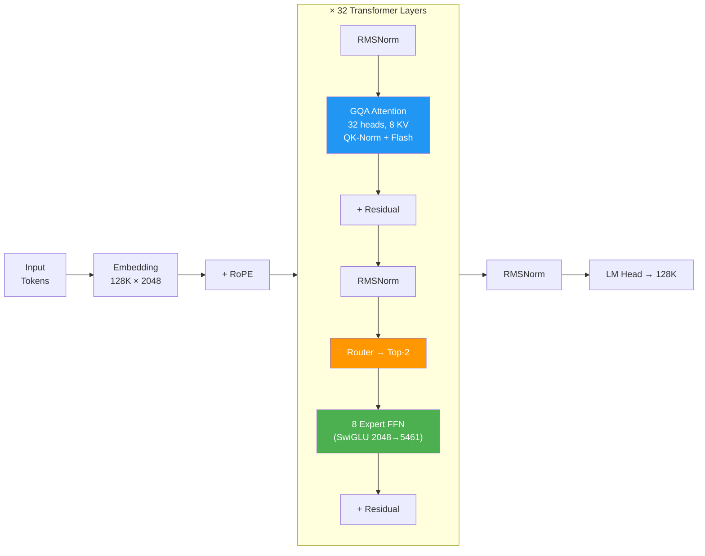
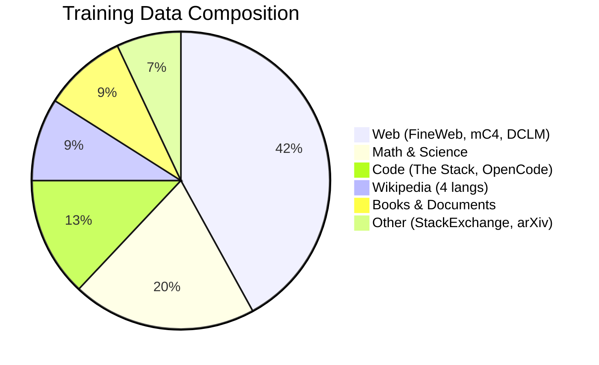

<div align="center">


# YUA MoE 9.2B

### Open Multilingual Mixture-of-Experts Language Model

**9.2B Total | 2.7B Active per Token | 8 Experts | 16+ Languages**

[](https://opensource.org/licenses/Apache-2.0)
[](https://www.python.org/)
[](https://github.com/jax-ml/jax)
[](#training-status)

[Model Card](docs/MODEL_CARD.md) · [Fine-Tuning Guide](docs/FINE_TUNING_GUIDE.md) · [Blog](https://medium.com/@dmsal020813/i-quit-waiting-for-gpt-and-built-my-own-llm-73a431fedfad) · [Training Logs](https://storage.googleapis.com/yua-data-v1/reports/training_log_moe_full.csv)

</div>

---

## What is YUA?

YUA MoE 9.2B is a **multilingual Mixture-of-Experts language model trained entirely from scratch** — no fine-tuning of existing models, no distillation, built from the ground up on Google TPU v4-32 using free TRC (TPU Research Cloud) credits.

It uses 8 experts with top-2 routing, activating only **2.7B parameters per token** while maintaining the capacity of a 9.2B model. This means inference cost similar to a ~3B dense model, with quality closer to a ~7B model.

> **Built by one person, with $0 compute budget, trained on 16+ languages.**

---

## Architecture



**How MoE routing works:** Each token goes through all 32 layers. At each layer, a router selects the top-2 experts out of 8. Only the selected experts compute — the rest stay idle. This means each token uses ~2.7B of the 9.2B total parameters.

```
Per token: Input → Embed → [RMSNorm → GQA → RMSNorm → Route → 2/8 Experts → Residual] × 32 → LM Head
Active:    2.7B params (2 experts per layer)
Inactive:  6.5B params (6 idle experts per layer)
```

<details>
<summary><b>Detailed Architecture (from source code)</b></summary>

```
YuaModel (src/model/yua_model.py)
│
├─ TokenEmbedding (src/model/embeddings.py)
│   └─ nn.Embedding(128000, 2048) + optional RMSNorm + RoPE
│
├─ × 32 TransformerBlock (src/model/transformer.py)
│   ├─ RMSNorm(2048, eps=1e-6)
│   ├─ CausalSelfAttention (src/model/attention.py)
│   │   ├─ Q: Linear(2048, 2048)  — 32 heads × 64 dim
│   │   ├─ K: Linear(2048, 512)   — 8 KV heads (GQA)
│   │   ├─ V: Linear(2048, 512)   — 8 KV heads (GQA)
│   │   ├─ O: Linear(2048, 2048)
│   │   ├─ QK-Norm: RMSNorm per head
│   │   ├─ RoPE (θ=500,000)
│   │   └─ Backend: auto (Flash > SDPA > manual)
│   ├─ + Residual
│   ├─ RMSNorm(2048, eps=1e-6)
│   ├─ MoE FFN (src/model/moe.py) — via create_ffn()
│   │   ├─ TopKRouter: Linear(2048, 8) → softmax → top-2
│   │   ├─ 8 × Expert SwiGLU FFN:
│   │   │   ├─ gate_proj: Linear(2048, 5461)
│   │   │   ├─ up_proj:   Linear(2048, 5461)
│   │   │   └─ down_proj:  Linear(5461, 2048)
│   │   ├─ Capacity limit + weight-priority token selection
│   │   └─ Aux loss: load balance + z-loss (fp32)
│   └─ + Residual
│
├─ RMSNorm(2048, eps=1e-6)
└─ LM Head: tied with embedding (2048 → 128000)

Loss = CE loss + MTP loss (optional) + MoE aux loss (layer-averaged)
```

</details>

### Specifications

| Component | Value |
|:---|:---|
| **Type** | Decoder-only Transformer + Sparse MoE |
| **Total Parameters** | 9.2B |
| **Active Parameters** | 2.7B per token |
| **Layers** | 32 |
| **Hidden Dim** (`d_model`) | 2,048 |
| **Attention** | 32 heads, 8 KV heads (GQA 4:1) |
| **Head Dim** | 64 |
| **Experts** | 8 per layer, top-2 routing |
| **FFN per Expert** | SwiGLU, dim 5,461 |
| **Vocabulary** | 128,000 (SentencePiece BPE + byte fallback) |
| **Position** | RoPE (θ=500,000) |
| **Norm** | RMSNorm (pre-norm) |
| **Attention Features** | QK-Norm, Flash Attention 2, GQA |
| **Context Length** | 2,048 (→ 32K planned via YaRN) |
| **Precision** | bfloat16 |
| **License** | Apache 2.0 |

### Why MoE over Dense?

```
Dense 7B:  Every parameter fires for every token → 7B FLOPs/token
MoE 9.2B:  Only 2/8 experts fire → 2.7B FLOPs/token

Result: 3.4× more capacity at same compute cost
```

---

## Training Status

> 🟢 **Training in progress** — updated live

| Metric | Value |
|:---|:---|
| **Current Step** | ~34K / 511K |
| **Epoch Progress** | 6.7% of 1 epoch |
| **Loss** | avg ~2.27, min ~1.95 |
| **Tokens Seen** | ~9B / 134B |
| **Step Time** | 2.1 sec |
| **Throughput** | 124,401 tokens/sec |
| **TFLOP/s** | 134.3 per device |
| **Uptime** | 25+ hours, zero crashes |
| **ETA (1 epoch)** | ~April 17, 2026 |

### Loss Curve

```
Loss
12 |*
   |  *
 8 |    *
   |      *
 4 |        * * *
   |              * * * * * * *
 2 |                            * * * * * * * *
   |____________________________________________
   0    5K   10K   15K   20K   25K   30K   35K   Step
```

Live CSV: [`training_log_moe_full.csv`](https://storage.googleapis.com/yua-data-v1/reports/training_log_moe_full.csv)

---

## Quick Start

### Loading the Model

```python
from transformers import AutoModelForCausalLM, AutoTokenizer
import torch

model_name = "yua-ai/yua-moe-9b"
tokenizer = AutoTokenizer.from_pretrained(model_name)
model = AutoModelForCausalLM.from_pretrained(
    model_name,
    torch_dtype=torch.bfloat16,
    device_map="auto",
)

# Generate
prompt = "인공지능의 미래는"
inputs = tokenizer(prompt, return_tensors="pt").to(model.device)
outputs = model.generate(
    **inputs,
    max_new_tokens=256,
    temperature=0.7,
    top_p=0.9,
    do_sample=True,
)
print(tokenizer.decode(outputs[0], skip_special_tokens=True))
```

### Multilingual Examples

```python
prompts = {
    "Korean":   "서울의 봄에 대해 설명해줘",
    "English":  "Explain quantum computing simply",
    "Japanese": "東京の観光スポットを教えて",
    "Chinese":  "什么是人工智能",
    "Code":     "def fibonacci(n):",
}

for lang, prompt in prompts.items():
    inputs = tokenizer(prompt, return_tensors="pt").to(model.device)
    out = model.generate(**inputs, max_new_tokens=128, temperature=0.7)
    print(f"[{lang}] {tokenizer.decode(out[0], skip_special_tokens=True)}\n")
```

---

## Training Details

### Data (987GB raw → 134B tokens, 477 ArrayRecord shards)



| Domain | Size | Languages |
|:---|---:|:---|
| Web crawl | 411 GB | ko, en, ja, zh + 12 langs (FineWeb2) |
| Math & Science | 200 GB | en, ja, zh |
| Code | 129 GB | Python, JS, Java, C++ + 28 langs |
| Wikipedia | 88 GB | ko, en, ja, zh |
| Books & Documents | 88 GB | en |
| Other | 71 GB | multilingual |
| **Total** | **987 GB** | **16+ languages** |

**Languages:** Korean, English, Japanese, Chinese, Arabic, Bengali, German, French, Hindi, Indonesian, Italian, Polish, Portuguese, Spanish, Thai, Turkish, Urdu, Vietnamese

### Infrastructure

| Setting | Value |
|:---|:---|
| **Framework** | [MaxText](https://github.com/AI-Hypercomputer/maxtext) (JAX/XLA) |
| **Hardware** | TPU v4-32 (4 hosts × 4 chips = 16 chips, 512 GB HBM) |
| **Optimizer** | AdamW (β₁=0.9, β₂=0.95, ε=1e-8, wd=0.1) |
| **Learning Rate** | 1e-4, cosine decay |
| **Warmup** | 0.5% of total steps |
| **Batch Size** | 8/device × 16 devices = 128 seqs (262K tok/step) |
| **Sequence Length** | 2,048 |
| **Gradient Clipping** | 1.0 |
| **MoE Aux Loss** | 0.01 |
| **Checkpointing** | Every 500 steps to GCS |
| **Compute Cost** | **$0** (Google TRC free credits) |

---

## Fine-Tuning

YUA MoE 9.2B supports LoRA, QLoRA, and full SFT fine-tuning. See the **[Fine-Tuning Guide](docs/FINE_TUNING_GUIDE.md)** for complete instructions including:

- **LoRA** — 20-24GB VRAM (RTX 3090/4090)
- **QLoRA** — 8-12GB VRAM (RTX 3060/4060)
- **Full SFT** — TPU or multi-GPU
- MoE-specific tips (router training, expert collapse prevention)

---

## Inference Options (coming after SFT — May 2026)

> Model weights will be available on HuggingFace after SFT completion. The examples below show planned usage.

### vLLM (planned)

```python
from vllm import LLM, SamplingParams

llm = LLM(model="yuaone/yua-moe-9b", dtype="bfloat16", tensor_parallel_size=1)
params = SamplingParams(temperature=0.7, top_p=0.9, max_tokens=256)
outputs = llm.generate(["인공지능의 미래는"], params)
print(outputs[0].outputs[0].text)
```

### Ollama (planned)

```bash
ollama run yua-moe-9b
```

### llama.cpp / GGUF (planned)

```bash
./llama-cli -m yua-moe-9b-Q4_K_M.gguf \
    -p "서울의 봄에 대해 설명해줘" \
    -n 256 --temp 0.7 --top-p 0.9
```

---

## Benchmarks

> ⏳ Evaluation in progress after 1 epoch completion (~April 17).

| Benchmark | Metric | YUA MoE 9.2B | OLMoE 7B | Phi-2 2.7B |
|:---|:---|:---:|:---:|:---:|
| MMLU | 5-shot | TBD | ~26% | ~50% |
| HellaSwag | 10-shot | TBD | — | ~73% |
| ARC-C | 25-shot | TBD | — | ~61% |
| HumanEval | pass@1 | TBD | — | ~48% |
| K-MMLU | 5-shot | TBD | — | — |

---

## Growth Roadmap


### Scaling Strategy
- **MoE upcycling**: Add experts (8→32→128) + shared experts (DeepSeek style)
- **Depth stacking**: Add layers for deeper models
- **No width expansion**: Proven to cause symmetry issues (see our [research notes](docs/HANDOVER.md))

---

## Project Structure

```
yua/
├── configs/             # Model & training configs
│   ├── maxtext_yua_7b_moe.yml    # MoE training config
│   ├── model_1b.yaml             # 1.3B architecture
│   └── model_7b_growth.yaml      # 7B architecture
├── scripts/
│   ├── build_sft_data.py          # SFT data pipeline (HF streaming)
│   ├── download_datasets_global.py # Data collection (45+ datasets)
│   ├── stream_shard_gcs.py        # ArrayRecord conversion
│   ├── convert_yua_to_maxtext.py  # PyTorch → MaxText converter
│   └── expand_checkpoint.py       # Growth family expansion
├── src/model/           # YUA model architecture (PyTorch)
├── docs/
│   ├── HANDOVER.md      # Full project state & history
│   ├── MODEL_CARD.md    # HuggingFace model card
│   └── AI_CHAMPION_DATA.md  # Competition data sheet
└── data/
    └── tokenizer/       # SentencePiece 128K vocab
```

---

## Reproducibility

Everything is open:

| Artifact | Location |
|:---|:---|
| Training code | This repo |
| Training config | `configs/maxtext_yua_7b_moe.yml` |
| Training logs (per-step) | [GCS CSV](https://storage.googleapis.com/yua-data-v1/reports/training_log_moe_full.csv) |
| Checkpoints | `gs://yua-data-v1/maxtext_moe/` |
| Data shards | `gs://yua-data-v1/maxtext_shards_text/` |
| Tokenizer | `gs://yua-data-v1/tokenizer/yua_128k_v2.model` |
| Raw data | `gs://yua-data-v1/raw/` (987 GB) |

---

## License

Apache License 2.0 — free for commercial and research use.

---

## Citation

```bibtex
@misc{yua2026moe,
    title   = {YUA MoE 9.2B: Open Multilingual Mixture-of-Experts Language Model},
    author  = {YUA Team},
    year    = {2026},
    url     = {https://github.com/yua-ai/yua},
    note    = {9.2B total, 2.7B active, 8 experts top-2,
               trained from scratch on 134B+ tokens, 16 languages,
               TPU v4-32, $0 compute (Google TRC)}
}
```

---

## Acknowledgments

This work was made possible by the generous support of the **Google TPU Research Cloud (TRC)** program, which provided free access to TPU v4-32 compute resources. We are deeply grateful for their commitment to supporting independent AI research.

- [Google TPU Research Cloud (TRC)](https://sites.research.google/trc/) — TPU v4-32 compute (Google Cloud Platform)
- [MaxText](https://github.com/AI-Hypercomputer/maxtext) — JAX training framework
- [Hugging Face](https://huggingface.co/) — Datasets & model hosting
- Open-source LLM community: [OLMoE](https://github.com/allenai/OLMoE), [DeepSeek](https://github.com/deepseek-ai), [Qwen](https://github.com/QwenLM), [Mistral](https://github.com/mistralai)
